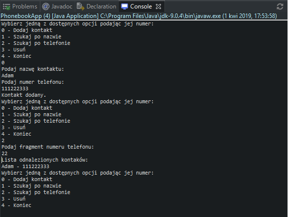

# Phonebook
> The console application allows you to manage a phonebook saved in a text file, created with Java SE 9.

## Table of contents
* [General info](#general-info)
* [Screenshots](#screenshots)
* [Technologies](#technologies)
* [Status](#status)

## General info
Application was created to improve knowledge through the training.

Available functionalities:
- adding new records,
- searching for part of the name,
- searching for part of the phone number,
- deleting records.

The phonebook is saved to a file when the application is closed.

## Screenshots

## Technologies
* JavaSE - version 9.0.4

## Status
Project is: _finished_
